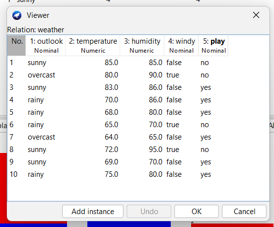
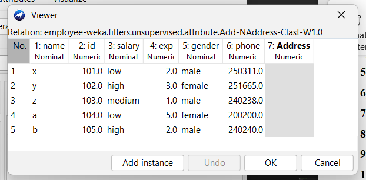
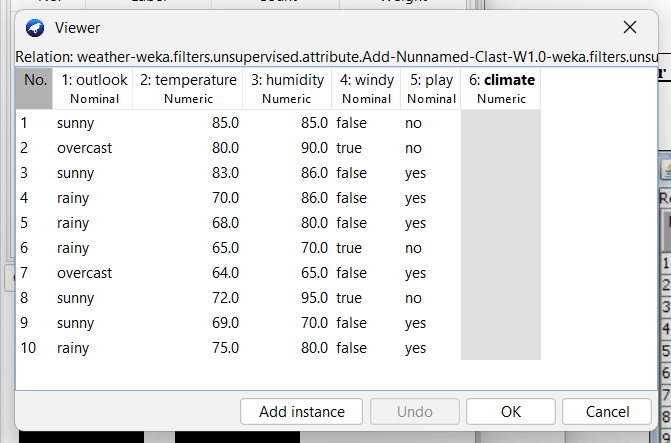
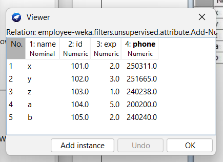
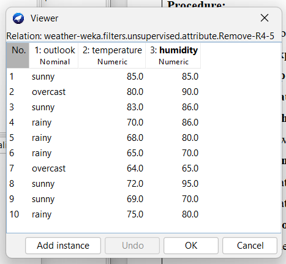
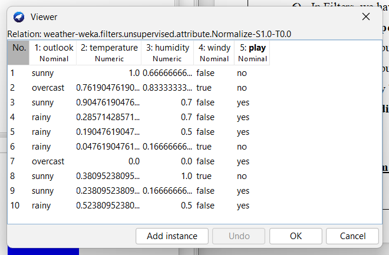

# Exp no : 01 CREATION OF EMPLOYEE, WEATHER DATASET IN WEKA DATA MINING AND ANALYSIS TOOL AND PERFORM PREPROCESSING
## NAME : SHRRUTHILAYA G
## REGISTER NUMBER : 212221230097
## DATE : 10.02.2024
## AIM: 
  To Create Employee, Weather dataset in WEKA Data Mining and Analysis Tool and perform preprocessing.
## PROCEDURE: 
1) Open Start -> Programs -> Accessories -> Notepad
2) Type the following training data set with the help of Notepad for Employee Table.

```
--------------
EMPLOYEE DATA
---------------
@relation employee
@attribute name {x, y, z, a, b}
@attribute id numeric
@attribute salary {low, medium, high}
@attribute exp numeric
@attribute gender {male, female}
@attribute phone numeric

@data
x, 101, low, 2, male, 250311
y, 102, high, 3 female, 251665
z, 103, medium, 1, male, 240238
a, 104, low, 5, female, 200200
b, 105, high, 2, male, 240240

--------------
WEATHER DATA
---------------
@relation weather
@attribute outlook {sunny, rainy, overcast}
@attribute temperature numeric 
@attribute humidity numeric
@attribute windy {true, false} 
@attribute play {yes, no}

@data sunny, 85.0, 85.0, false, no 
overcast, 80.0, 90.0, true, no 
sunny, 83.0, 86.0, false, yes 
rainy, 70.0, 86.0, false, yes 
rainy, 68.0, 80.0, false, yes 
rainy, 65.0, 70.0, true, no 
overcast, 64.0, 65.0, false, yes 
sunny, 72.0, 95.0, true, no 
sunny, 69.0, 70.0, false, yes 
rainy, 75.0, 80.0, false, yes
```
3) After that the file is saved with .arff file format.
4) Minimize the arff file and then open Start -> Programs -> weka-3-4.
5) Click on weka-3-4, then Weka dialog box is displayed on the screen.
6) In that dialog box there are four modes, click on explorer.
7) Explorer shows many options. In that click on ‘open file’ and select the arff file
8) Click on edit button which shows employee table on weka.

## OUTPUT:
### EMPLOYEE DATA:

### WEATHER DATA:


## PROCEDURE:
### 1) ADD -> Pre-Processing Technique:
1) Start -> Programs -> Weka-3-4 -> Weka-3-4
2) Click on explorer.
3) Click on open file.
4) Select Weather.arff file and click on open.
5) Click on Choose button and select the Filters option.
6) In Filters, we have Supervised and Unsupervised data.
7) Click on Unsupervised data.
8) Select the attribute Add.
9) A new window is opened.
10) In that we enter attribute index, type, data format, nominal label values for Climate.
11) Click on OK.
12) Press the Apply button, then a new attribute is added to the Weather Table.
13) Save the file.
14) Click on the Edit button, it shows a new Weather Table on Weka.

## OUTPUT:
### EMPLOYEE DATA:

### WEATHER DATA:
 

### 2) REMOVE -> Pre-Processing Technique:

1) Start -> Programs -> Weka-3-4 -> Weka-3-4
2) Click on explorer.
3) Click on open file.
4) Select Weather.arff file and click on open.
5) Click on Choose button and select the Filters option.
6) In Filters, we have Supervised and Unsupervised data.
7) Click on Unsupervised data.
8) Select the attribute Remove.
9) Select the attributes windy, play to Remove.
10) Click Remove button and then Save.
11) Click on the Edit button, it shows a new Weather Table on Weka.

## OUTPUT:
### EMPLOYEE DATA:

### WEATHER DATA:
 

### 3) NORMALIZE -> Pre-Processing Technique:

1) Start -> Programs -> Weka-3-4 -> Weka-3-4
2) Click on explorer.
3) Click on open file.
4) Select Weather.arff file and click on open.
5) Click on Choose button and select the Filters option.
6) In Filters, we have Supervised and Unsupervised data.
7) Click on Unsupervised data.
8) Select the attribute Normalize.
9) Select the attributes temparature, humidity to Normalize.
10) Click on Apply button and then Save.
11) Click on the Edit button, it shows a new Weather Table with normalized values on Weka.

## OUTPUT:
### EMPLOYEE DATA:

### WEATHER DATA:
 
## RESULT: 
Thus the program for generating employee and weather datasets has been developed, and preprocessing has been accomplished successfully.
